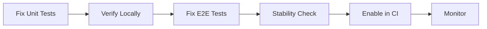
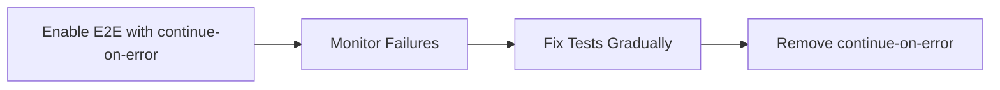

# CI/CD Quick Fixes - Akcje do Natychmiastowego Wdrożenia

**Data:** 2025-11-16  
**Dla:** Development Team  
**Priorytet:** 🔴 CRITICAL

---

## 🚨 Krytyczne problemy wymagające natychmiastowej akcji

### 1. E2E Testy są wyłączone (HIGHEST PRIORITY)

**Lokalizacja:** `.github/workflows/pull-request.yml` linia 70

**Problem:**
```yaml
if: false  # Temporarily disabled due to failing E2E tests
```

**Impact:** 
- ❌ Brak weryfikacji P0/P1 requirements z test-plan-2.md
- ❌ Krytyczne user stories nie są testowane (Logowanie, Konfiguracja, Generowanie)
- ❌ Risk regresu w produkcji

**Quick Fix Option 1: Allow Failure (Recommended for immediate deployment)**

```yaml
e2e-test:
  name: E2E Tests
  runs-on: ubuntu-latest
  timeout-minutes: 60
  needs: lint
  environment: integration
  if: true  # ✅ ENABLE
  continue-on-error: true  # ✅ Don't block PR
```

**Korzyści:**
- ✅ E2E testy będą wykonywane i zbierać dane
- ✅ Nie blokuje mergowania PR
- ✅ Team widzi failures i może je naprawić stopniowo

**Quick Fix Option 2: Fix Tests First (Recommended for quality)**

Najpierw napraw testy lokalnie, potem włącz w CI.

**Komenda do lokalnego debugowania:**
```bash
# 1. Ustaw zmienne środowiskowe
cp .env.example .env.test
# Wypełnij zmienne

# 2. Uruchom jeden test z debugiem
npm run test:e2e:debug -- job-generation-f4.spec.ts

# 3. Zobacz screenshoty
open test-results/*/test-failed-*.png

# 4. Napraw problemy

# 5. Uruchom wszystkie testy 3x dla stabilności
npm run test:e2e
npm run test:e2e
npm run test:e2e
```

---

### 2. Unit Tests - 35 failujących (HIGH PRIORITY)

**Lokalizacja:** Różne pliki (patrz ISSUE_FAILING_TESTS.md)

**Najprostsze do naprawy (14 testów):**

#### A. StyleSelectCards.test.tsx (4 testy)

**Problem:** `useFormContext()` returns null

**Fix:**
```typescript
// Przed
import { render, screen } from '@testing-library/react';
import { StyleSelectCards } from '../StyleSelectCards';

test('renders style options', () => {
  render(<StyleSelectCards />);
  // ❌ FAIL: useFormContext is null
});

// Po
import { render, screen } from '@testing-library/react';
import { FormProvider, useForm } from 'react-hook-form';
import { StyleSelectCards } from '../StyleSelectCards';

const TestWrapper = ({ children }: { children: React.ReactNode }) => {
  const methods = useForm({
    defaultValues: {
      style: 'professional',
      language: 'pl',
      systemMessage: ''
    }
  });
  return <FormProvider {...methods}>{children}</FormProvider>;
};

test('renders style options', () => {
  render(<StyleSelectCards />, { wrapper: TestWrapper });
  // ✅ PASS
});
```

**Pliki do naprawy:**
- `src/components/forms/controls/__tests__/StyleSelectCards.test.tsx`
- `src/components/forms/controls/__tests__/LanguageSelect.test.tsx`

**Szacowany czas:** 1-2 godziny

#### B. JobProgressPage.test.tsx (7 testów)

**Problem:** `useJobProgress is not defined`

**Fix:**
```typescript
// Dodaj na początku pliku testowego
vi.mock('@/components/hooks/useJobProgress', () => ({
  useJobProgress: vi.fn(() => ({
    job: mockJobData,
    isLoading: false,
    error: null,
    cancel: vi.fn(),
    refetch: vi.fn()
  }))
}));

// W konkretnym teście możesz override:
test('shows loading state', () => {
  vi.mocked(useJobProgress).mockReturnValue({
    job: null,
    isLoading: true,
    error: null,
    cancel: vi.fn(),
    refetch: vi.fn()
  });
  
  render(<JobProgressPage jobId="123" />);
  expect(screen.getByText(/Ładowanie/)).toBeInTheDocument();
});
```

**Szacowany czas:** 2-3 godziny

---

## ⚡ Quick Wins - Możliwe w <30 min

### 1. Włącz E2E w trybie informacyjnym

**Edytuj:** `.github/workflows/pull-request.yml`

```yaml
# Linia 70: Zmień z
if: false

# Na:
if: true
continue-on-error: true  # Dodaj tę linię
```

**Commit:**
```bash
git add .github/workflows/pull-request.yml
git commit -m "ci: enable E2E tests in informational mode"
git push
```

### 2. Dodaj npm audit do workflow

**Edytuj:** `.github/workflows/pull-request.yml`

**Dodaj nowy job po lint:**

```yaml
  security-audit:
    name: Security Audit
    runs-on: ubuntu-latest
    timeout-minutes: 5
    needs: lint
    continue-on-error: true  # Don't block on warnings
    
    steps:
      - name: Checkout code
        uses: actions/checkout@v4
      
      - name: Setup Node.js
        uses: actions/setup-node@v4
        with:
          node-version: 22
          cache: 'npm'
      
      - name: Install dependencies
        run: npm ci
      
      - name: Run npm audit
        run: npm audit --audit-level=high
```

### 3. Dodaj test summary

**Dodaj na końcu workflow:**

```yaml
  test-summary:
    name: Test Summary
    runs-on: ubuntu-latest
    needs: [lint, unit-test, e2e-test]
    if: always()
    
    steps:
      - name: Download artifacts
        uses: actions/download-artifact@v4
        
      - name: Generate summary
        run: |
          echo "# Test Summary" >> $GITHUB_STEP_SUMMARY
          echo "" >> $GITHUB_STEP_SUMMARY
          echo "## Unit Tests" >> $GITHUB_STEP_SUMMARY
          echo "Coverage artifact: unit-test-coverage" >> $GITHUB_STEP_SUMMARY
          echo "" >> $GITHUB_STEP_SUMMARY
          echo "## E2E Tests" >> $GITHUB_STEP_SUMMARY
          echo "Results: playwright-html-report" >> $GITHUB_STEP_SUMMARY
```

---

## 🛠️ Narzędzia pomocnicze

### Script: Uruchom tylko failujące testy

**Stwórz:** `scripts/run-failing-tests.sh`

```bash
#!/bin/bash

echo "Running only failing unit tests..."

# Form context tests
npm test -- StyleSelectCards.test.tsx
npm test -- LanguageSelect.test.tsx

# Page tests
npm test -- JobProgressPage.test.tsx
npm test -- JobsHistoryPage.test.tsx

# Other
npm test -- GenerateForm.test.tsx
npm test -- ProductsTable.test.tsx
npm test -- GeneratePage.test.tsx

echo "Done!"
```

**Użycie:**
```bash
chmod +x scripts/run-failing-tests.sh
./scripts/run-failing-tests.sh
```

### Script: Check E2E stability

**Stwórz:** `scripts/check-e2e-stability.sh`

```bash
#!/bin/bash

RUNS=3
FAILED=0

echo "Running E2E tests $RUNS times to check stability..."

for i in $(seq 1 $RUNS); do
  echo ""
  echo "=== Run $i/$RUNS ==="
  
  if npm run test:e2e; then
    echo "✅ Run $i passed"
  else
    echo "❌ Run $i failed"
    FAILED=$((FAILED + 1))
  fi
done

echo ""
echo "=== Summary ==="
echo "Total runs: $RUNS"
echo "Failed: $FAILED"
echo "Success rate: $(( (RUNS - FAILED) * 100 / RUNS ))%"

if [ $FAILED -eq 0 ]; then
  echo "✅ All tests stable!"
  exit 0
else
  echo "⚠️ Tests are flaky. Fix before enabling in CI."
  exit 1
fi
```

**Użycie:**
```bash
chmod +x scripts/check-e2e-stability.sh
./scripts/check-e2e-stability.sh
```

---

## 📋 Checklist Naprawy

### Phase 1: Stabilizacja testów (1-2 dni)

- [ ] Naprawa StyleSelectCards.test.tsx (4 testy)
- [ ] Naprawa LanguageSelect.test.tsx (3 testy)
- [ ] Naprawa JobProgressPage.test.tsx (7 testów)
- [ ] Naprawa JobsHistoryPage.test.tsx (6 testów)
- [ ] Veryfikacja: `npm test` - 0 failures

**Oczekiwany rezultat:**
```
✅ 354 tests passing (from 319)
❌ 0 tests failing (from 35)
```

### Phase 2: E2E Debugging (2-3 dni)

- [ ] Lokalne uruchomienie: `npm run test:e2e:debug`
- [ ] Analiza screenshotów w test-results/
- [ ] Identyfikacja root cause każdego failure
- [ ] Naprawa testów jeden po drugim
- [ ] Stabilność check: `./scripts/check-e2e-stability.sh`

**Oczekiwany rezultat:**
```
✅ 3/3 runs successful
Success rate: 100%
```

### Phase 3: CI Integration (pół dnia)

- [ ] Włączenie E2E w CI (`if: true`)
- [ ] Usunięcie `continue-on-error` (jeśli testy stabilne)
- [ ] Aktualizacja status-comment (już zrobione ✅)
- [ ] Monitoring przez 3-5 PRs

**Oczekiwany rezultat:**
```
CI Pipeline: All Checks Passed ✅
- Lint: ✅ Passed
- Unit Tests: ✅ Passed (354/354)
- E2E Tests: ✅ Passed
```

---

## 🚀 Deployment Strategy

### Option A: Fix First, Deploy Later (Recommended)



**Czas:** 5-7 dni  
**Risk:** Low  
**Quality:** High

### Option B: Deploy with Allow-Failure (Faster)



**Czas:** 1 dzień + background fixes  
**Risk:** Medium  
**Quality:** Medium (improves over time)

---

## 📞 Pytania i Wsparcie

### Kto powinien naprawić co?

| Task | Assigned To | ETA |
|------|-------------|-----|
| Unit tests (form context) | Frontend Dev | 2 dni |
| Unit tests (hooks) | React Dev | 2 dni |
| E2E debugging | QA + Dev pair | 3 dni |
| CI workflow updates | DevOps | 1 dzień |

### Jak priorytetyzować?

1. **Day 1-2:** Form context tests (14 tests) - najłatwiejsze
2. **Day 2-3:** Pozostałe unit tests (21 tests)
3. **Day 3-5:** E2E debugging i naprawa
4. **Day 5-6:** Włączenie E2E w CI
5. **Day 6-7:** Monitoring i stabilizacja

### Kiedy można uznać za "Done"?

- ✅ Wszystkie 354 unit testy passing
- ✅ E2E testy 100% stable (3/3 runs local)
- ✅ E2E włączone w CI bez `continue-on-error`
- ✅ 5 kolejnych PRs przechodzi bez failures

---

## 🎯 Success Metrics

**Before:**
- Unit: 319/354 passing (89.9%)
- E2E: Disabled
- CI: Partial coverage

**Target:**
- Unit: 354/354 passing (100%) ✅
- E2E: Enabled & stable (>95% pass rate) ✅
- CI: Full P0/P1 coverage ✅

**Timeline:** 5-7 dni roboczych

---

**Ostatnia aktualizacja:** 2025-11-16  
**Status:** Ready for implementation  
**Next review:** Po zakończeniu Phase 1

